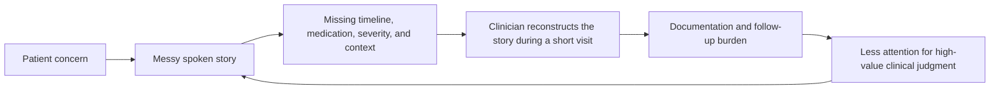
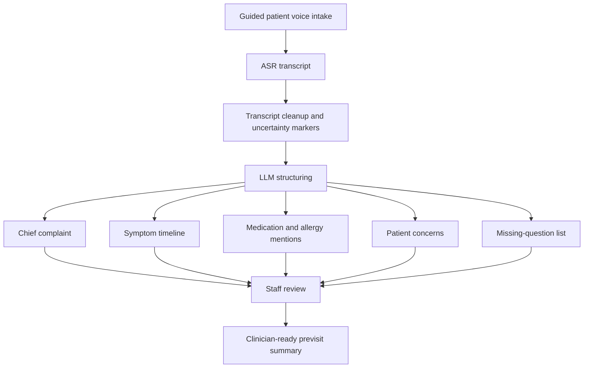
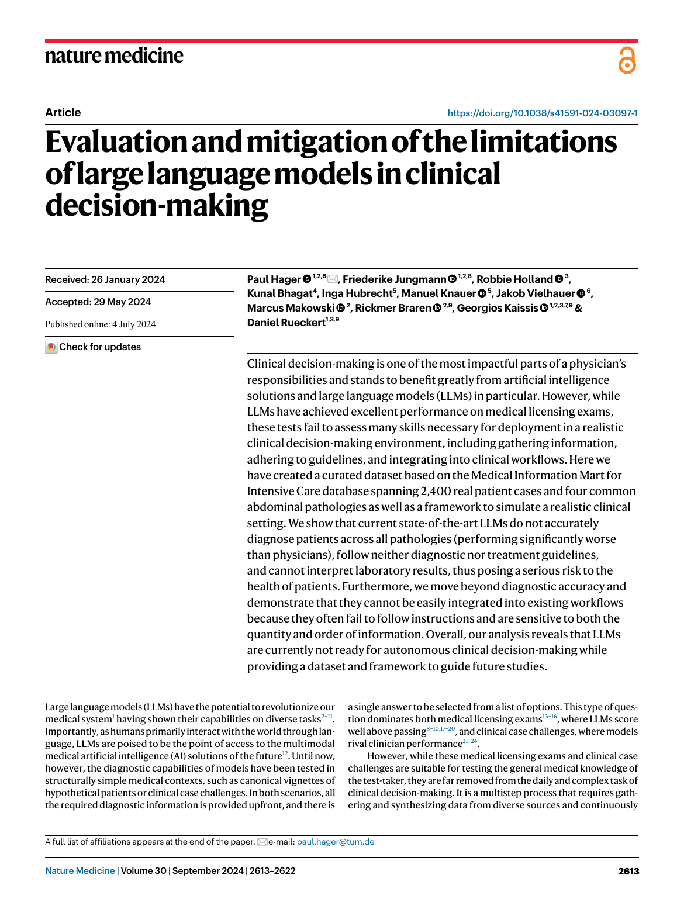
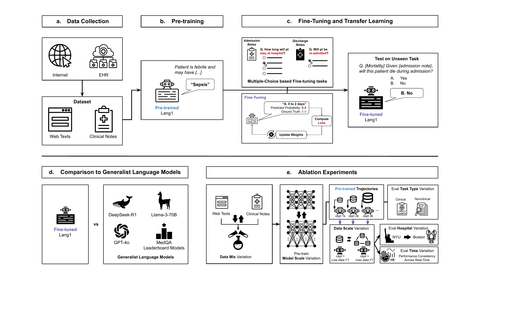
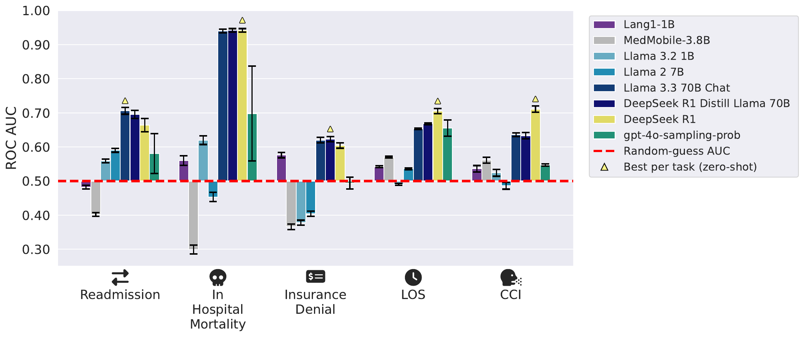
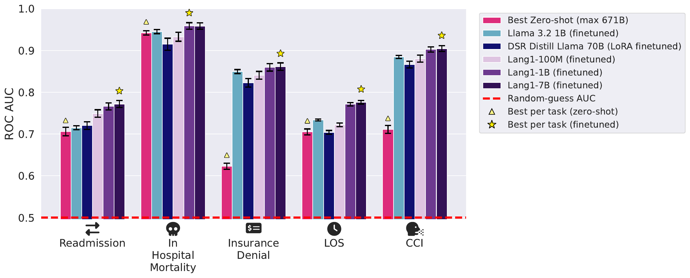
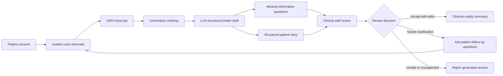
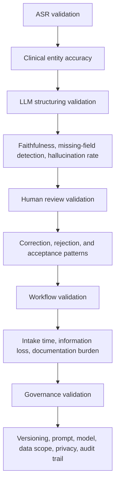

# From Speech Intake to Clinician Summary

## ASR and LLMs for Smart Biomedical Pre-visit Workflows

Course: `Introduction of Smart Biomedicine`
Student: `Jason Chia-Sheng Lin`
Student ID: `513559004`
Target use: `20-minute English video report without slides`
Report format: `single scrollable Markdown report with diagrams, source figures, and figure-text explanations`

## How To Present This Markdown Report

This file is designed to be the visual surface for a recorded report. The report should be presented by scrolling through this page, not by switching slides. The speaker should spend more time on the diagrams and figure-text explanations than on reading every sentence on screen.

Recommended timing:

| Section | Time | Speaker job |
| --- | ---: | --- |
| Opening question and thesis | `0:00-2:00` | State the problem and the positive operating scope. |
| Definitions | `2:00-4:00` | Define ASR, LLM, previsit intake, and staff-review support. |
| Clinical workflow problem | `4:00-6:30` | Explain why the patient story is the first bottleneck. |
| Current AI landscape | `6:30-9:30` | Show that AI scribes and clinical LLMs are already relevant. |
| Evidence boundary | `9:30-12:00` | Use Hager et al. and Lang1 to define the responsible scope. |
| Proposed architecture | `12:00-16:00` | Walk through the ASR plus LLM staff-review workflow. |
| Synthetic output and validation | `16:00-18:30` | Show what the output should look like and how to evaluate it. |
| Closing | `18:30-20:00` | Restate the contribution and next validation path. |

## Core Question

Can patient speech become a useful clinician-ready previsit summary without making the AI the doctor?

## One-Sentence Thesis

ASR plus LLM systems create the strongest near-term smart-biomedicine value when they are designed as `staff-review previsit intake support`: patient speech is transcribed, structured, and summarized before the visit, then reviewed and corrected by clinical staff before it influences care.

## Key Definitions

| Term | Definition for this report | Operating boundary |
| --- | --- | --- |
| ASR | Automatic speech recognition that converts patient speech into text. | ASR provides a transcript, not clinical judgment. |
| LLM | A large language model that can organize, summarize, and transform language. | The LLM structures information but does not become the clinical authority. |
| Previsit intake | Information collection before the patient meets the clinician. | The goal is preparation, not replacement of the visit. |
| Staff-review support | A workflow where generated content must be checked by clinical staff. | The reviewed summary is the output, not an autonomous AI decision. |
| Clinician-ready summary | A concise, structured intake note that helps clinicians see the patient story, missing fields, and uncertainty. | It must preserve uncertainty and remain editable. |

## The Real Workflow Problem

Good clinical decisions require a usable patient story. In practice, the patient story often arrives under time pressure. The patient may speak in fragments, skip dates, forget medication names, or mix symptoms with concerns and expectations. Clinical staff then need to reconstruct the timeline, identify missing details, and decide what must be clarified.

The first useful AI target is therefore not autonomous diagnosis. The first useful target is a cleaner intake surface before the visit.

**Figure-text explanation.** This diagram shows the workflow bottleneck that motivates the report. The core problem is not simply that clinicians need more AI. The core problem is that clinical reasoning begins from a patient story that is often incomplete, time-pressured, and hard to document. The smart-biomedicine opportunity is to use speech and language technology before the visit to make the story easier to inspect, correct, and complete.

## Why Speech-To-Summary Is Attractive

Speech is a natural input channel for patients. ASR can capture the spoken narrative, and an LLM can transform that transcript into structured intake fields. The system can also identify missing information and preserve uncertainty.

**Figure-text explanation.** This architecture keeps each component in its proper role. ASR listens and transcribes. The LLM organizes the transcript and creates draft fields. Clinical staff review the output before it becomes a clinician-ready summary. The clinical value comes from a better review surface, not from allowing the AI to make final medical decisions.

## Evidence Landscape

AI documentation tools are already entering healthcare workflows. Ambient AI scribes can generate draft notes from spoken clinical encounters. This makes the speech-to-note direction plausible. However, documentation support and autonomous clinical decision-making are different risk categories.

The key design question is:

> Where should ASR and LLMs sit in the clinical workflow, and what should they be allowed to own?

## Source Figure 1 - Hager et al. Boundary Paper

**Figure-text explanation.** Hager et al.'s Nature Medicine paper, `Evaluation and mitigation of the limitations of large language models in clinical decision-making`, is the boundary-setting paper for this report. Its value here is not that it directly studies ASR or previsit intake. Its value is that it shows why LLMs should not be framed as autonomous clinical decision-makers in realistic clinical workflows. The paper supports a positive scope control: use LLMs for structured, clinician-reviewed support, while keeping diagnosis, triage, and treatment decisions under human clinical authority.

## Source Figure 2 - Lang1 Overview

**Figure-text explanation.** This figure from Jiang et al.'s Lang1 paper shows a full-cycle modeling pipeline: clinical and web text pretraining, next-token prediction, instruction finetuning, comparison with generalist models, and ablation studies across data mix, model scale, task type, hospital, and time. The report uses this figure to make one practical point: healthcare AI needs workflow-specific design and evaluation. A generic language model is not automatically ready for hospital operations or previsit clinical workflows.

## Source Figure 3 - Zero-Shot Generalist And Specialist Performance

**Figure-text explanation.** This figure supports the claim that broad model capability is not enough. In the Lang1 study, both generalist and specialist models underperform in zero-shot clinical operations tasks. For this report, the implication is direct: a generic ASR plus LLM pipeline should not be treated as ready for clinical use just because it can generate fluent text. It needs task-specific design, review, and validation.

## Source Figure 4 - Finetuned Specialist Performance

**Figure-text explanation.** This figure shows that finetuned Lang1 specialists can outperform zero-shot baselines and other comparison models on ReMedE tasks. The report uses this as a forward-looking design lesson. If a previsit intake system becomes a real clinical tool, it should move from a general prompt demonstration toward workflow-specific training, supervised evaluation, temporal validation, and human review data.

## Proposed System Architecture

The proposed system is `staff-review previsit intake support`.

**Figure-text explanation.** The decision node is the safety center of the architecture. The system is useful only because the output remains reviewable and rejectable. Staff can accept with edits, ask follow-up questions, or reject unsupported generated sections. This makes the workflow compatible with clinical responsibility: AI prepares the review surface, while humans own the final clinical use.

## What The System May Do

- Convert patient voice into a transcript.
- Mark uncertain words, unclear medication names, unclear numbers, and unclear timelines.
- Structure the patient story into intake fields.
- Summarize symptoms, timeline, medications, allergies, prior history, and patient concerns.
- Generate missing-information questions.
- Produce a draft that staff can inspect, correct, accept, or reject.

## What The System Must Not Do

- It must not make a final diagnosis.
- It must not assign definitive triage acuity.
- It must not prescribe treatment.
- It must not bypass clinical staff review.
- It must not use real patient data in a course demo.
- It must not hide uncertainty behind fluent language.

## Synthetic Example Output

This example is fictional and is included only to show the intended output shape.

| Field | Draft content |
| --- | --- |
| Chief concern | Recurring dizziness before clinic visit. |
| Symptom timeline | Started about two weeks ago; worse when standing quickly. |
| Patient concern | Worried because episodes happened several times before work. |
| Uncertainty flag | Medication name unclear in audio. |
| Missing questions | Duration of each episode; blood pressure history; recent medication changes; associated chest pain, shortness of breath, headache, or fainting. |
| Review status | Staff review required before clinical use. |

**Figure-text explanation.** This table is the practical center of the report. The draft is useful because it makes the patient story easier to check. It is also safe by design because it does not produce a diagnosis. The uncertainty flag and missing-question list are not weaknesses. They are part of the value because they show clinical staff what needs clarification.

## Validation Path

**Figure-text explanation.** A responsible validation path must evaluate the workflow layer by layer. ASR should be checked for clinically meaningful entities, not only general word error rate. The LLM should be checked for faithfulness and hallucination. Human review should be measured through correction and rejection patterns. Workflow value should be measured through intake readiness and documentation burden. Governance should record model version, prompt version, privacy, data scope, and audit trail.

## Risk And Scope-Control Matrix

| Risk | Why it matters | Scope control |
| --- | --- | --- |
| ASR error | Drug names, numbers, negation, and timing can be clinically important. | Mark uncertainty and require staff verification. |
| LLM hallucination | Fluent summaries can create false confidence. | Evaluate faithfulness and preserve uncertainty. |
| Missing context | Patients may omit information they do not know is relevant. | Generate missing-question lists. |
| Workflow mismatch | A technically good output may still fail in clinic. | Evaluate staff correction and intake time. |
| Privacy and responsibility | Clinical data needs explicit governance. | Use consent, audit trails, and data-scope controls. |

## Final Takeaway

ASR plus LLM is most useful in smart biomedicine when it prepares a better clinical review surface before the visit. The first responsible product shape is not an autonomous doctor. It is a staff-review previsit intake workflow that turns patient speech into structured, inspectable, and correctable information.

This design connects a real clinical bottleneck to a practical AI architecture. It also keeps the scope aligned with the evidence: use AI for transcription, structuring, summarization, and missing-question generation, then validate each layer before clinical expansion.

## References

- Hager et al., `Evaluation and mitigation of the limitations of large language models in clinical decision-making`, Nature Medicine, 2024.
- Jiang et al., `Generalist Foundation Models Are Not Clinical Enough for Hospital Operations`, arXiv, 2025.
- Sinsky et al., physician time allocation and EHR burden.
- Murphy et al., EHR inbox notification burden.
- Hingle, electronic health records and implementation challenge.
- Ma et al., large language model-powered ambient AI scribe in an academic medical center.
